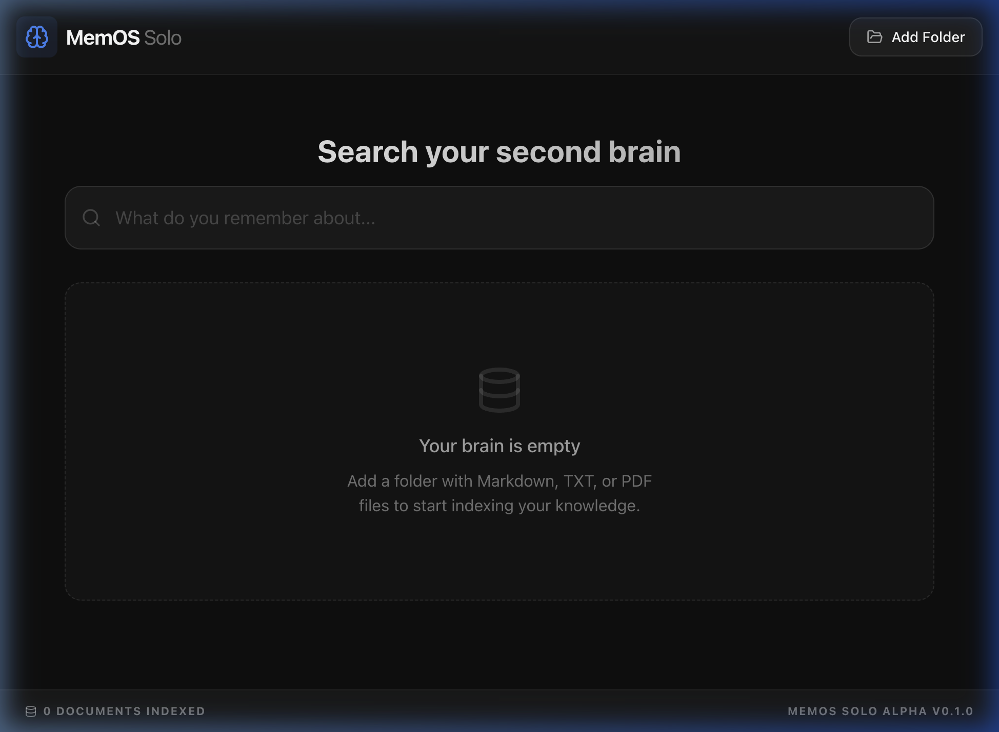
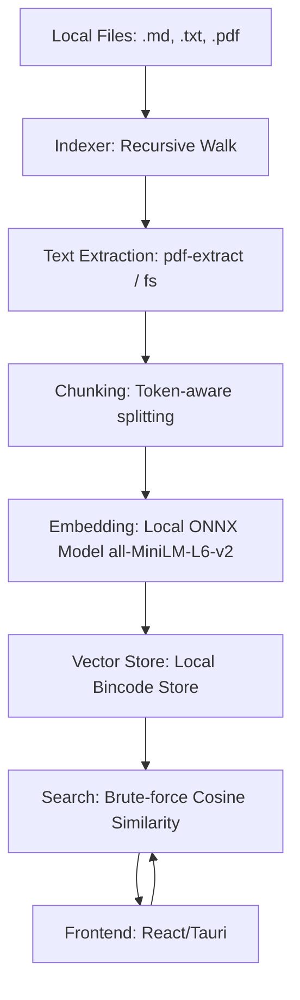

# MemOS: Never forget a thought.

MemOS is a local-first, privacy-centric "second brain" that indexes and semantically searches everything you've ever read or written. 

No clouds. No subscriptions. Just your knowledge, instantly accessible.

## The Problem

You have hundreds of notes, PDFs, and markdown files. You remember reading something important but can’t find it because you don’t remember the exact words. Regular search fails because it's limited to keywords. Cloud services offer solutions but harvest your data. **MemOS solves all three.**

## Key Features

- **Semantic Search:** Find documents by meaning, not just exact keywords. Powered by local ONNX models (`all-MiniLM-L6-v2`).
- **Privacy First:** All data is stored locally in a high-performance vector store. No data ever leaves your machine.
- **Multiple File Types:** Supports Markdown (`.md`), plain text (`.txt`), and PDFs (`.pdf`).
- **Blazing Fast:** Built with Rust and Tauri for native desktop performance.
- **Zero Friction:** No external dependencies like `protoc` or complex database setups required for building or running.
- **Efficient:** Uses a quantized ONNX model to keep the application footprint small (~22MB model).

## How It Works

MemOS operates entirely on your local machine. When you add a folder, the following pipeline is executed:

### Privacy Architecture
- **Zero Network Requests:** MemOS does not make any network requests at runtime.
- **Embedded Intelligence:** The embedding model is bundled into the binary at compile time.
- **Local Storage:** All indexes and metadata are stored in your application data directory (`~/.memos`).

## Why MemOS?

| Tool | Semantic Search | Local-Only | Open Source | No Build Bloat | Works with PDFs |
| :--- | :---: | :---: | :---: | :---: | :---: |
| macOS Spotlight | ❌ keyword | ✅ | ❌ | ✅ | ✅ |
| DocFetcher | ❌ keyword | ✅ | ✅ (Eclipse) | ❌ | ✅ |
| Rewind AI | ✅ | ❌ cloud | ❌ | ❌ | ❌ |
| **MemOS** | **✅** | **✅** | **✅ (MIT)** | **✅** | **✅** |

## Installation

### Windows
1. Go to the [Releases](https://github.com/spidervirus/memos/releases) page.
2. Download the `.msi` or `.exe` installer for the latest version.
3. Run the installer.

### macOS (Apple Silicon & Intel)
1. Go to the [Releases](https://github.com/spidervirus/memos/releases) page.
2. Download the `.dmg` file for the latest version.
3. Open the `.dmg` and drag the MemOS app to your Applications folder.
*(Note: Releases are notarized by Apple)*

### Linux
1. Go to the [Releases](https://github.com/spidervirus/memos/releases) page.
2. Download the `.AppImage` or `.deb` file.

## Quick Start

1. **Open MemOS.**
2. **Add Sample Data:** Click **Add Folder** and select the `sample_docs` folder included in this repository. This folder contains a few Markdown and text files on diverse topics (Rust, Meeting Notes, Recipes) so you can see semantic search in action immediately.
3. **Index:** Wait a few seconds for the indexing to complete.
4. **Search:** Start typing. Try searching for "offline access" or "memory management". MemOS will find relevant documents even if the exact words don't match.

## Roadmap

- ✅ Semantic search over local files (now)
- 🔜 Browser history & email ingestion
- 🔜 Ask your memory anything (local RAG with a small LLM)
- 🔜 Plugin system for community connectors

## Contributing

We actively welcome new contributors! Whether you're fixing a bug or adding a feature, your help is appreciated.

- Check out our [CONTRIBUTING.md](CONTRIBUTING.md) to get started.
- **Good First Issues:**
    - "Add .epub support"
    - "Build a dark/light theme toggle"
    - "Add a search filter by file type"

## License & Philosophy

MemOS is **MIT licensed** and will always be free and open. We believe your memory should belong to you, not a corporation.

---
Built with ❤️ by the MemOS Community.
